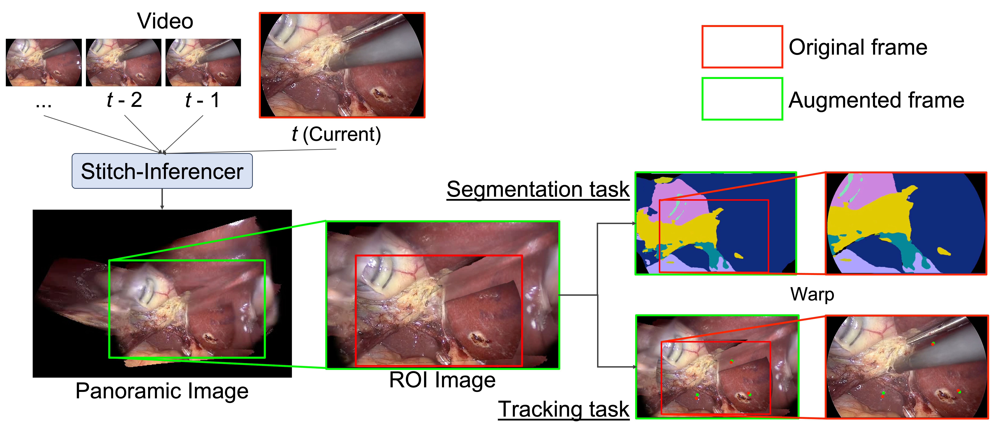

## stitch-Inferencer

An experimental project for **1. stitching a temporal sequence of frames into a canvas**, and **2. running inference on the stitched canvas**, then **3. warping predictions back to the original frame coordinates**.

`stitch_seg.StitchInferencer` keeps the stitching/state (homographies, canvas, masks, etc.) and calls a user-provided segmentation model (`torch.nn.Module`) on cropped canvas regions.

---

## Usage
### Environment setup

```bash
uv venv
uv sync
source .venv/bin/activate
```
### Use on segmentation
```python
from stitch_seg import StitchInferencer

seg_model = MySegModel().cuda().eval() # Assume input is 0~255 tensor, please define preprocess pipeline at MySegmodel.forward()
inferencer = StitchInferencer(model=seg_model)

cap = cv2.VideoCapture("video.mp4")
while True:
    ret, frame_np = cap.read()
    if not ret:
        break
    frame_torch = inferencer.preprocess_frame(frame_np)
    pred = inferencer(frame_torch)
    
```
Here is how to prepare preprocess pipeline to segmentation model
```python
class MySegModel(nn.Module):
    def __init__(self):
        self.model = smp.Unet("tu-convnext_base", classes=13) # example, which assumes img / 255.0 as input
        self.model.load_state_dict(torch.load("weights/last.pt", map_location="cuda"), strict=True)
        self.model.eval()
        self.mean = torch.tensor([0.485, 0.456, 0.406]).view(-1, 1, 1)
        self.std = torch.tensor([0.229, 0.224, 0.225]).view(-1, 1, 1)

    def _prepare_input(self, img_tensor: torch.Tensor):
        img_tensor = img_tensor.float() / 255.0
        # If needed
        # img_tensor = (img_tensor - mean) / std
        return img_tensor

    def _predict_to_shape(self, tensor: torch.Tensor, target_hw) -> torch.Tensor:
        pred = self.model(tensor)
        pred_resized = F.interpolate(
            pred, 
            size=target_hw, 
            mode='bilinear', 
            align_corners=False
        )
        return pred_resized

    def forward(self, canvas: torch.Tensor) -> torch.Tensor:
        input_tensor = self._prepare_input(canvas)
        target_hw = canvas.shape[-2:]
        output = self._predict_to_shape(input_tensor, target_hw)  
        return output
```
If you want to predict only on certain frames:
```python
while True:
    ret, frame_np = cap.read()
    if not ret:
        break
    frame_torch = inferencer.preprocess_frame(frame_np)
    inferencer.step_canvas(frame_torch)
    if predict:
        pred = self.model_inference()
```


### Use on Tracking

```python
from stitch_seg import StitchTracker
import torch

tracker = Mytracker().cuda().eval()
infer = StitchTracker()

crop_bbox, crop, frame_u = infer.step(frame)
coords = tracker(crop)
coords = infer.reproject(coords)
```

---

## DevContainer Setup
You can reproduce TensorRT implementation on this container.
A `.devcontainer` configuration is provided for VS Code / GitHub Codespaces.

**Base image**: `nvcr.io/nvidia/tensorrt:26.01-py3`
(TensorRT 10.x, Python 3.12, CUDA 12.8)

**Prerequisites on the host machine**:
- NVIDIA Driver ≥ 570 (CUDA driver API 13.0)

**Steps**:

1. Clone the repository:

```bash
git clone <repo-url> stitch_seg_dev
cd stitch_seg_dev
```

2. Open the folder in VS Code and select **"Reopen in Container"**, or run:

```bash
devcontainer up --workspace-folder .
```

The container starts with `--gpus=all --net=host --ipc=host` so GPU and host networking are available.

3. Inside the container, install Python dependencies:

```bash
uv sync
```

4. Verify GPU access:

```bash
python -c "import torch; print(torch.cuda.is_available(), torch.version.cuda)"
```

---

## Installation

### uv (recommended)

This repository includes `uv.lock` for reproducible environments.

```bash
uv venv
uv sync
```

---

## Weights
Please downloads model weights from release.
By default, the code expects these relative paths (from the repository root):

- **ALIKED**: `weights/aliked-n16.pth` (`cfg.aliked_weights`)
- **LightGlue**: `weights/aliked_lightglue_v0-1_arxiv.pth` (`cfg.lightglue_weights`)
- **Tool detector**: `weights/convnext_tiny-unet-best.pt` (`cfg.tool_detector_weights`)
- **Port detector**: `weights/convnext_tiny-unet-cholec80_port.pt` (`cfg.port_detector_weights`)

For production, prefer **absolute paths** in `cfg.*_weights`.

---


## Speed Benchmark Reproduction

All benchmark scripts live in `exp/` and are run as Python modules from the repository root. Three pipeline variants are supported.

> **Note**: `VIDEO.mp4` should be replaced with the path to your input video. Benchmarks measure per-frame inference latency (ONNX CUDA EP, IOBinding) and report FPS, mean/p95/p99 latency, and save results to a JSON file.

---

### Variant 1: Stitch-only

Exports and benchmarks only the canvas stitching pipeline (ALIKED + LightGlue + homography + canvas blend), without segmentation.

**Step 1 — Export to ONNX**

```bash
python exp/export_onnx_only.py \
    --out onnx_only/only.onnx \
    --height 480 --width 854
```

This produces `onnx_only/only.onnx` (step model) and `onnx_only/only_init.onnx` (first-frame model). FP16 variants (`.fp16.onnx`) are also written automatically.

**Step 2 — (Optional) Export to TensorRT engine**

```bash
python exp/export_trt_only.py \
    --onnx-step onnx_only/only.onnx \
    --out-dir trt_engine_only \
    --fp16
```

**Step 3 — Benchmark**

```bash
# FP32
python exp/bench_onnx_only.py \
    --onnx-step onnx_only/only.onnx \
    --video VIDEO.mp4 \
    --start 100 --end 1000 --warmup 100 \
    --name results/stitch_only_fp32.json

# FP16
python exp/bench_onnx_only.py \
    --onnx-step onnx_only/only.onnx \
    --video VIDEO.mp4 \
    --start 100 --end 1000 --warmup 100 \
    --fp16 \
    --name results/stitch_only_fp16.json
```

---

### Variant 2: Segmentation-only (frame-by-frame baseline)

Exports and benchmarks only the segmentation model (no stitching), to measure pure segmentation throughput.

**Step 1 — Export to ONNX**
Please prepare your trained segmentation model and weights and replace with the model in exp/export_onnx_seg.py. Or you can prepare segmentation models with following exp/cholecseg8k_benchmark/README.md
```bash
python exp/export_onnx_seg.py \
    --out onnx_seg/seg.onnx \
    --height 480 --width 854 \
    --num-classes 13 \
    --seg-weights models/unetpp/fold0.pth \
    --fp16
```

**Step 2 — Benchmark**

```bash
# FP32
python exp/bench_onnx_seg.py \
    --onnx-file onnx_seg/seg.onnx \
    --video VIDEO.mp4 \
    --start 100 --end 1000 --warmup 100 \
    --name results/seg_fp32.json

# FP16
python exp/bench_onnx_seg.py \
    --onnx-file onnx_seg/seg.onnx \
    --video VIDEO.mp4 \
    --start 100 --end 1000 --warmup 100 \
    --fp16 \
    --name results/seg_fp16.json
```

---

### Variant 3: Stitch + Segmentation (full pipeline)

Exports and benchmarks the full pipeline: canvas stitching + segmentation inference.

**Step 1 — Export to ONNX**

```bash
python exp/export_onnx.py \
    --out onnx_stitch/stitch.onnx \
    --height 480 --width 854 \
    --num-classes 13 \
    --seg-weights models/unetpp/fold0.pth \
    --tool-weights weights/convnext_tiny-unet-best.pt \
    --port-weights weights/convnext_tiny-unet-cholec80_port.pt
```

This produces `onnx_stitch/stitch.onnx`, `onnx_stitch/stitch_init.onnx`, and FP16 variants.

**Step 2 — Export to TensorRT engine**

```bash
python exp/export_trt.py \
    --onnx-step onnx_stitch/stitch.onnx \
    --out-dir trt_engine \
    --fp16
```

**Step 3 — Benchmark**

```bash
# FP32
python exp/bench_onnx.py \
    --onnx-file onnx_stitch/stitch.onnx \
    --video VIDEO.mp4 \
    --start 100 --end 1000 --warmup 100 \
    --name results/stitch_seg_fp32.json

# FP16
python exp/bench_onnx.py \
    --onnx-file onnx_stitch/stitch.onnx \
    --video VIDEO.mp4 \
    --start 100 --end 1000 --warmup 100 \
    --fp16 \
    --name results/stitch_seg_fp16.json
```

---

### Benchmark output format

Each benchmark writes a JSON file such as:

```json
{
  "model": { "onnx_file": "...", "fp16": false, "providers": ["CUDAExecutionProvider"] },
  "benchmark": { "measured_frames": 901, "reset_count": 0 },
  "latency_ms": { "mean": 12.3, "p50": 11.9, "p95": 14.2, "p99": 18.1 },
  "fps": { "mean": 81.3, "at_p95_latency": 70.4 },
  "per_frame_ms": [...]
}
```

---

## Configuration (`cfg`)

Default values live in `stitch_seg/config.py` (`DEFAULT_CFG_VALUES`). Common knobs:

- **stitch / features**: `method`, `canvas_scale_x/y`, `feature_*`, `feature_ransac_thresh`
- **masking**: `seg_min_score`, `seg_max_coverage`, `tool_mask_dilate_px`
- **device**: `device`

---

## License
Please read `LICENSE.txt`
CC BY-NC-SA 4.0

---

## Citation
```
@InProceedings{ StitchInferencer_MICCAISafeSurg2026,
                 author = { Kikuchi, Shunsuke AND Kouno, Atsushi AND Matsuzaki, Hiroki },
                 title = { { Stitch-Inferencer: Enhance Endoscopic Video Segmentation and Tracking via Panoramic Reconstruction } }, 
                 booktitle = {Medical Image Computing and Computer Assisted Intervention -- MICCAI 2026 Workshops and Challenges},
                 year = {2026},
                 publisher = {Springer Nature Switzerland},
                 volume = { LNCS pending },
                 month = {pending},
                 pages = { pending },
              }
```

---

## Acknowledgements

This project depends on / is inspired by:

- [LightGlue](https://github.com/cvg/LightGlue) / [ALIKED](https://github.com/Shiaoming/ALIKED) ([alikked-tensorrt](https://github.com/ajuric/aliked-tensorrt), [LightGlue-ONNX](https://github.com/fabio-sim/LightGlue-ONNX) as well)
- [segmentation-models-pytorch](https://github.com/qubvel-org/segmentation_models.pytorch)
